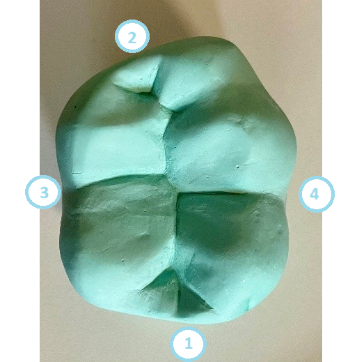
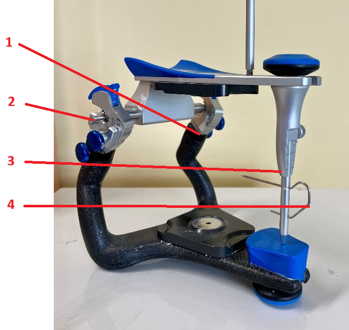

<!--
author:    Hilke Domsch; Alexander Meiwald
email:     hilke.domsch@gkz-ev.de
date:      2025-10-06
version:   0.0.10

narrator:  Deutsch Female
language:  de

edit:      https://liascript.github.io/LiveEditor/?/github/Ifi-DiAgnostiK-Project/zahntechnik-grundkurs-g-zahn-23

icon:      https://ifi-diagnostik-project.github.io/assets/img/Logo_234px.png
logo:      assets/images/point_to_teeth.jpg

title:     Grundkurs ZAHN 23 - Krone / CAD-Schiene
comment:   G-ZAHN 23 Arbeitsunterlagen und zahntechnische Vorprodukte erstellen
attribute: https://unsplash.com/de/fotos/ein-mann-und-eine-frau-mit-einem-touchscreen-gerat-Bd0RmCsJOCc
tags:      Zahntechniker,
           Zahnersatz,
           Prothese,
           Zahnprothese,
           Krone,
           CAD-Schiene

link:      style.css
import:    https://raw.githubusercontent.com/Ifi-DiAgnostiK-Project/LiaScript_DragAndDrop_Template/refs/heads/main/README.md
           https://raw.githubusercontent.com/Ifi-DiAgnostiK-Project/Piktogramme/refs/heads/main/makros.md
           https://raw.githubusercontent.com/Ifi-DiAgnostiK-Project/Textilpflegesymbole/refs/heads/main/makros.md
           https://raw.githubusercontent.com/Ifi-DiAgnostiK-Project/LiaScript_ImageQuiz/refs/heads/main/README.md
           https://raw.githubusercontent.com/Ifi-DiAgnostiK-Project/Bildersammlung/refs/heads/main/makros.md
-->

# Kurs G-ZAHN 23: Krone / CAD-Schiene

Sie haben in den letzten Tagen verschiedene Fachbegriffe aus der Morphologie der Zähne wiederholt, den Umgang mit einem Artikulator geübt sowie mittels CAD eine Schiene konstruiert.      __Überprüfen Sie Ihr Wissen.__

<!-- class="highlight" -->
Wir wünschen Ihnen viel Erfolg und Spaß beim Beantworten der Fragen!

 

")<!-- style="width: 400px" -->

## 1. Topografie des Zahnes

<section class="flex-container border">

<!-- class="highlight"-->
Ordnen Sie den Zahlen 1 - 4 im Bild den jeweils richtigen Fachbegriff zu.

 

<!-- data-randomize data-show-partial-solution -->
1<!--style="color: green; font-weight: bolder"-->  =  [[palatinal | (mesial)   | distal  |   bukkal]]

 

<!-- data-randomize data-show-partial-solution -->
2<!--style="color: green; font-weight: bolder"-->  =  [[palatinal | mesial   |  (distal)  |   bukkal]]

 

<!-- data-randomize data-show-partial-solution -->
3<!--style="color: green; font-weight: bolder"-->  =  [[ (lingual) | mesial   | distal  |   bukkal]]

 

<!-- data-randomize data-show-partial-solution -->
4<!--style="color: green; font-weight: bolder"-->  =  [[lingual | mesial   | distal  |   (bukkal) ]]

<!-- style="max-width: 350px; width: 100%" -->

</section>

## 2. Der Artikulator

<section class="flex-container border">

<!-- class="highlight"-->
Ziehen Sie die jeweils richtige Antwort in das entsprechende Feld.

<!-- data-randomize data-show-partial-solution -->
Die Zahl 1<!--style="color: red; font-weight: bolder"--> bezeichnet [->[  (den Bennetwinkel) | die Kondylführung ]].
 
Die Zahl 2<!--style="color: red; font-weight: bolder"--> meint  [->[  (die Kondylartrommel) | die Fixierschraube ]].

------------

<!-- data-randomize data-show-partial-solution -->
Die Zahl 3<!--style="color: red; font-weight: bolder"--> zeigt zum [->[  (Stützstift) | Quersteg]].  
Die Zahl 4<!--style="color: red; font-weight: bolder"--> bezeichnet den [->[  (Inzisalzeiger) | Inzisalstift ]].

<!-- style="max-width: 350px; width: 100%" -->

</section>

## 3. Die Kauebene

<section class="flex-container border">

<!-- class="highlight"-->
Welche Begriffe werden synonym für "Kauebene" verwendet?

<!--style="color: red"-->Es sind mehrere Antworten möglich.

<!-- data-randomize -->
- [[X]] Okklusionsebene
- [[X]] Bissebene
- [[ ]] Campersche Ebene
- [[ ]] Inzisalebene
- [[ ]] Kauachse

</section>

 

, Pixabay Content License, veröffentlicht am 3. März 2021.")<!-- style="width: 400px" -->

## 4. CAD und CAM

<!--style="color: blue; font-weight: bolder"-->Ziehen Sie die jeweils richtige Antwort in das entsprechende Feld.

<section class="flex-container border">

<!-- data-randomize data-show-partial-solution -->
Mittels CAD<!--style="color: green; font-weight: bolder"--> erfolgt die [->[  (digitale Konstruktion) | automatisierte Fertigung ]] von Objekten.

</section>

<section class="flex-container border">

<!-- data-randomize data-show-partial-solution -->
Mit Hilfe von CAM<!--style="color: green; font-weight: bolder"--> erfolgt die [->[  (maschinelle Fertigung) | digitale Planung und Gestaltung ]] des Zahnersatzes.

</section>

<section class="flex-container border">

<!-- class="highlight"-->
Die Abkürzung CAD steht für...

<!-- data-randomize -->
- [( )] Computer Assisted Dentistry
- [(X)] Computer Aided Design
- [( )] Computer Automatic Drafting
- [( )] Computer Artifical Design

</section>

<section class="flex-container border">

<!-- class="highlight"-->
Die Abkürzung CAM steht für...

<!-- data-randomize -->
- [( )] Computer Animated Modeling
- [(X)] Computer Aided Manufacturing
- [( )] Computer Adjustment Mechanism
- [( )] Computer Assisted Milling

</section>

## 5. Mindestabstand Schiene - Parodontium

<section class="flex-container border">

<!-- class="highlight"-->
Wie groß sollte der Mindestabstand einer digital konstruierten Schiene zum marginalen Parodontium sein?

<!-- data-randomize -->
- [( )] 0,5 mm
- [(X)] 1 mm
- [( )] 1,5 mm
- [( )] 2 mm

</section>

 

, Pixabay Content License.")<!-- style="max-width: 200px; width: 100%" -->

## Super gemacht! 🙌

, Pixabay Content License, veröffentlicht am 19. Januar 2019.")

